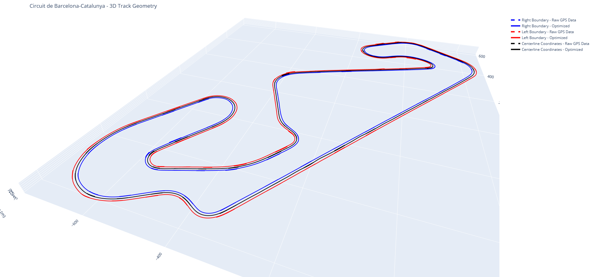

# Track Model Optimization

# Overview  
The track model provides the simulated vehicle with a path to follow, defined by the track curvature as a function of arc length distance. This module is implemented in Python using CasADi and is based on the methodology described in:  

[1] Giacomo Perantoni and David J.N. Limebeer, "Optimal Control of a Formula One Car on Three-Dimensional Track — Part 1: Track Modelling and Identification"  

This module takes raw GPS coordinates (latitude, longitude, altitude) of points along the left and right track boundaries (recorded in the direction of travel) and passes them through an optimizer that simultaneously converts them into a Frenet-coordinate ribbon model and smooths the track geometry, producing continuous curves that represent the track boundaries with minimal boundary errors. The resulting model provides well-defined track curvatures (Normal, torsion, and geodesic), heading angles, track widths as a function of centerline arc length, suitable for use with vehicle and tire models in simulations.

  
   
  <em>3D ribbon model of Circuit de Barcelona-Catalunya — raw GPS boundary data (dashed) vs optimized Frenet-frame model (solid)</em>

**Key Capabilities of the Module**
1. Converts raw GPS track boundary data into srutcutred and closed Frenet coordinate track model
2. Compatible with both **clockwise and anti-clockwise** track layouts
3. Can be used to generate both, 2D and 3D track models
4. Accepts left and right boundary data with **unequal number of points**, no resampling or preprocessing required
5. Simultaneously optimizes and smoothens track geometry, producing continuous track curvatures
6. Outputs include relative track curvatures (torsion, normal, geodesic), and track width as a function of arc length
7. Compatible with vehicle dynamics and tire models for simulations

# How it Works  

## Ribbon Modeling

Ribbons are centeral to road models and can be studied in terms of surfaces which in turn can be studied in terms of spines (curves) which may represent the centerline of the ribbon. A curve can be represented as :  
 
*C* = {**x**(s) = [x(s), y(s), z(s)]T} ∈ **R**3: s ∈ [s0, sf], with s being the arc length of *C* 
 
A moving coordinate frame is defined along the curve *C*, consisting of three orthonormal vectors that form a right-handed coordinate system. The tangent vector $\mathbf{t}(s) = \dot{\mathbf{x}}(s)$ points along the direction of travel, the principal normal $\mathbf{p}(s) = \dot{\mathbf{t}}/|\dot{\mathbf{t}}|$ points toward the center of curvature, and the binormal vector $\mathbf{b}(s) = \mathbf{t} \times \mathbf{p}$ is perpendicular to both. Together, these three vectors define the local Frenet frame at each point along the track centerline.

A ribbon *R* is constructed along the curve *C* by introducing a unit camber vector $\mathbf{n}(s)$ that lies in the plane of the ribbon and is perpendicular to the tangent vector $\mathbf{t}(s)$. This defines a surface with both width and twist, represented as:  
 
$$R = \{\mathbf{r}(s,n) = \mathbf{x}(s) + n.\mathbf{n}(s)\} \in \mathbb{R}^3, \quad s \in [s_0, s_f], \quad n \in [n_l(s), n_r(s)]$$  
 
where $s$ is the arc length along *C* and $n$ is the lateral offset within the ribbon plane. The limits $n_l(s)$ and $n_r(s)$ define the left and right track boundaries respectively at each point along the centerline. \mathbf{n} = 0 represents the curve *C*. The unit camber vector \mathbf{n}(s) can be described in terms of vector \mathbf{p}(s) and \mathbf{b}(s) and a twist angle γ(s) as:  
 
$$\mathbf{n}(s) = \mathbf{p}(s)\cos(\boldsymbol{\gamma}(s)) - \mathbf{b}(s)\sin(\boldsymbol{\gamma}(s))$$  
 
A unit normal vector $\mathbf{m}(s) = \mathbf{t}(s) \times \mathbf{n}(s)$ is defined perpendicular to the ribbon surface, completing the right-handed coordinate system for the ribbon frame. The curvatures of the ribbon can be derived as:  
 
1. Relative Torsion: $\omega_x = \tau + \dot{\gamma}$
2. Normal Curvature: $\omega_y = \kappa \sin(\gamma)$
3. Geodesic Curvature: $\omega_z = \kappa \cos(\gamma)$
 
where κ and τ are the curvature and torsion of the curve C respectively.
For the complete mathematical derivation, refer to [1].

## Optimizer

The track optimization is formulated as a Nonlinear ProBLEM (NLP) and solved using **IPOPT** (Interior Point OPTimizer) through the CasADi library. The continuous dynamics are discretized via **Direct Multiple Shooting** with 4th Order Runge-Kutta (RK4) integration across N uniformly spaced intervals along the track arc length, where N is user-defined.  
**A higher N produces a smoother, more accurate track model at the cost of increased computation time.**

### Dynamics Definition

The state vector (X) in terms of centerline arc length (s) for the track model can be defined as:  
 
X(s) = [x(s), y(s), z(s), $\theta(s)$, $\mu(s)$, $\phi(s)$, $\dot{\theta}(s)$, $\dot{\mu}(s)$, $\dot{\phi}(s)$, nl(s), nr(s)]T  
 

where $\theta$, $\mu$ and $\phi$ represent the euler angles describing elementary rotations about z-axis, y-axis and x-axis respectively. nl(s) and nr(s) represent the left- and right-hand track widths along s.  
The ribbon dynamics is given by:  
 
$\ddot{X}$ = f(s,X,U) = $[\cos(\theta).\cos(\mu), \sin(\theta).\cos(\mu), -\sin(\mu), \dot{\theta}, \dot{\mu}, \dot{\phi}, \ddot{\theta}, \ddot{\mu}, \ddot{\phi}, \dot{n_l}, \dot{n_r}]^T$  
 
where U = $[\ddot{\theta}, \ddot{\mu}, \ddot{\phi}, \dot{n_l}, \dot{n_r}]^T$ is the **control vector**. **The track dynamics $\ddot{X}$ = f(s,X,U) serves as an equality constraint for optimizer**.

# Installation & Dependencies  

# Usage  

# Outputs  
